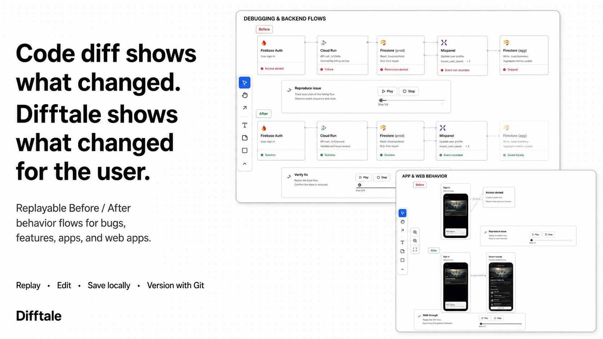

# Difftale



**English** · [繁體中文](README.zh-TW.md)

Difftale turns text diffs into visual behavior stories: one local whiteboard shows Before and After flows, app/web/mobile screen captures, service nodes, one-way request and response edges, runtime states, and replayable user journeys.

It ships as both a React Flow board and a Codex skill. The Board stays editable and durable on the local machine; Git versioning is optional and never pushes without an explicit request.

## Quick start

Requirements: Node.js `>=22.13.0`.

```bash
npm install
npm run board
```

`npm run board` validates the Board JSON, starts the local renderer and token-protected Save Bridge, waits for readiness, and opens the complete `BOARD_URL`. Keep the `config`, `save`, and `saveToken` query parameters: they bind the canvas to its local file. If the Save Bridge is unavailable, editing is locked instead of silently losing changes.

The Board UI is English by default. Use the `繁中` button or add `?lang=zh-TW` to switch the interface to Traditional Chinese; Difftale preserves every other query parameter when switching. Board card content remains user-editable in any language.

## Create a Board

Every Board is a local bundle. For a project-tracked Board, use:

```text
.difftale/boards/<slug>/
├── board.json
└── assets/
    ├── logos/
    └── screens/
```

For local-only storage, Difftale uses `~/.difftale/projects/<project-id>/boards/<slug>/`. Existing `.behavior-debug-board` bundles remain readable.

Render a Board config:

```bash
npm run board -- --config /absolute/path/to/board.json --port auto
```

Run fast browser QA and capture the final After state:

```bash
npm run board:qa -- \
  --config /absolute/path/to/board.json \
  --port auto \
  --flow after \
  --final-step \
  --screenshot outputs/board.jpg
```

Add `--full` when changing renderer behavior to verify replay, loading states, text editing, autosave, version history, drag, zoom, and Fit view.

## Screens and behavior flows

Schema version 3 treats local PNG/JPEG/WebP captures as first-class `screen` nodes. A screen is part of the journey—not an attachment to a generic service card. Frame selection follows explicit user context, project layout/platform code, the actual viewport, then image geometry; ambiguous mobile, browser, or desktop-app framing must be confirmed.

Behavior rules are intentionally strict:

- Before and After live on the same canvas.
- Every edge represents exactly one direction; a request and its response use separate edges.
- All edges, arrowheads, and labels are visible before playback.
- Fan-out edges may curve gently and place branch labels in separate lanes.
- The story explains behavior, cause, and user-visible outcome—not commits or code diffs.
- Screen captures and reliable logo assets are stored locally with immutable filenames.

See the [Board schema](skills/difftale/references/board-schema.md), [screen capture guidance](skills/difftale/references/screenshots.md), and [rendering stack](skills/difftale/references/rendering-stack.md).

## Version history

Canvas autosave updates the current `board.json`; explicit Board versions capture meaningful milestones. Version comparison reports semantic changes as Added, Removed, Changed, and Moved instead of a JSON line diff.

```bash
node skills/difftale/scripts/board-version.mjs create \
  --config /absolute/path/to/board.json \
  --storage local \
  --title "Access flow fixed"
```

Git mode creates a local commit containing only `.difftale/boards/<slug>/`. Unrelated staged and unstaged work is preserved. Pushes and pull requests still require an explicit user request. Local mode snapshots `board.json` and every referenced local asset, and creates a safety backup before restore.

## Install as a Codex skill

Link the skill from this repository so its source remains Git-tracked:

```bash
mkdir -p ~/.codex/skills
ln -s "$(pwd)/skills/difftale" ~/.codex/skills/difftale
```

After restarting Codex, try:

```text
Use Difftale to show this app behavior change as a local Before/After Board.
```

The skill first asks whether to use Git versioning, local-only storage, or cancel. It does not create files until the user chooses. Successful completion includes opening the local interactive Board—not only returning JSON, Markdown, or a static image.

## Logos

Exact product logos are resolved through the optional [theSVG MCP server](https://www.npmjs.com/package/@thesvg/mcp-server), then official brand pages or trustworthy registries. If no reliable asset exists, Difftale uses a service-category Lucide icon and never invents a brand mark.

```json
{
  "mcpServers": {
    "thesvg": {
      "command": "npx",
      "args": ["-y", "@thesvg/mcp-server"]
    }
  }
}
```

See [logo sources](skills/difftale/references/logo-sources.md) and [third-party notices](THIRD_PARTY_NOTICES.md).

## Quality checks

```bash
npm run check
```

This validates the skill structure, unit/integration/routing/CLI behavior, and the production build. Public skill files, fixtures, tests, and documentation use generic roles and fictional examples; user product names, repositories, paths, raw code/logs, private URLs, identifiers, and screenshots stay only in that user's local Board bundle.

## Contributing

External contributors can fork the repository, create a focused branch, push to their fork, and open a pull request against `main`. See [CONTRIBUTING.md](CONTRIBUTING.md).

Code is available under the [MIT License](LICENSE). Third-party brand marks remain the property of their respective owners and are not relicensed by MIT.
